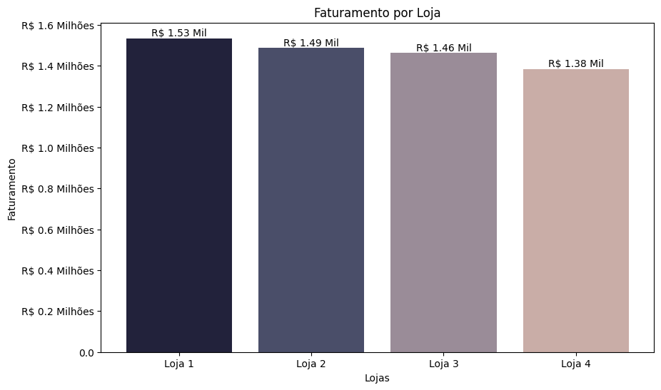
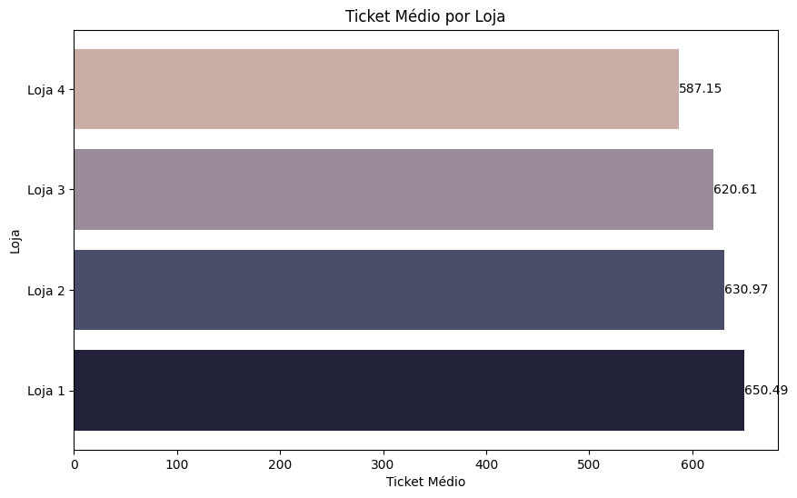
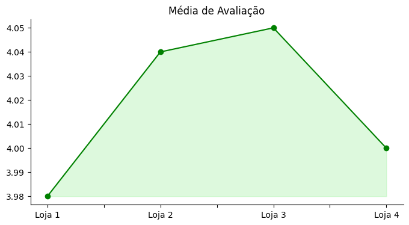
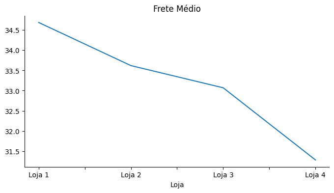

# Challenge1_Data_Science_Alura

# 📊 Desafio Alura Store – Análise de Desempenho das Lojas com Python

## 🎯 Propósito da Análise

Este notebook tem como objetivo simular a rotina de um analista de dados ao resolver o desafio **Alura Store**, utilizando **Python** e **visualizações com Matplotlib**.

A análise busca responder à seguinte pergunta:  
> **Qual das quatro lojas da Alura Store o Sr. João deve vender com base em seu desempenho comercial?**

Durante o processo, foram aplicadas técnicas fundamentais de análise de dados, incluindo:

- Leitura e manipulação de dados com **Pandas**
- Criação de gráficos com **Matplotlib**
- Interpretação de **indicadores de performance (KPIs)**
- Consolidação dos resultados em um **relatório com recomendação final**

---

## 🧠 Estrutura da Análise

O notebook está dividido em seções para facilitar o entendimento da lógica e da análise realizada:

1. **Importação de Bibliotecas e Leitura dos Dados**  
   Os dados são lidos diretamente de arquivos CSV disponíveis online.

2. **Faturamento Total e Ticket Médio**  
   Cálculo e comparação do faturamento e do valor médio gasto por cliente.

3. **Produtos Mais e Menos Vendidos**  
   Análise dos produtos com melhor e pior desempenho em vendas.

4. **Avaliação Média dos Clientes**  
   Comparativo da média de satisfação dos clientes por loja.

5. **Custo Médio de Frete**  
   Comparação entre os custos médios de entrega das lojas.

6. **Faturamento Mensal**  
   Avaliação da variação do faturamento ao longo dos meses.

7. **Relatório Consolidado e Recomendação Final**  
   Resumo da performance de cada loja e recomendação de qual loja vender.

---

## 📈 Exemplos de Gráficos e Insights

Durante a análise, diversos gráficos foram gerados para facilitar a interpretação dos dados, como:

- **Faturamento Total por Loja**  
  Identifica quais lojas geram mais receita.  
  

- **Ticket Médio por Loja**  
  Compara o valor médio gasto por cliente.  
  

- **Média de Avaliação dos Clientes**  
  Analisa a satisfação do cliente em cada loja.  
  

- **Custo Médio de Frete por Loja**  
  Compara o custo logístico entre as lojas.  
  

- **Faturamento Mensal por Loja**  
  Observa tendências ao longo dos meses.  
  

---

## ▶️ Como Executar o Notebook

1. **Abra o notebook no Google Colab ou em um ambiente Jupyter Notebook.**
2. **Execute todas as células em ordem.**

### Pré-requisitos

Este notebook utiliza:

- `pandas`
- `matplotlib`
- `numpy`

No Google Colab, essas bibliotecas já vêm instaladas. Em ambiente local, instale com:

```bash
pip install pandas matplotlib numpy
```
## Dados
Os dados são lidos diretamente de URLs públicas em CSV:

import pandas as pd

url1 = "https://raw.githubusercontent.com/alura-es-cursos/challenge1-data-science/refs/heads/main/base-de-dados-challenge-1/loja_1.csv"
url2 = "https://raw.githubusercontent.com/alura-es-cursos/challenge1-data-science/refs/heads/main/base-de-dados-challenge-1/loja_2.csv"
url3 = "https://raw.githubusercontent.com/alura-es-cursos/challenge1-data-science/refs/heads/main/base-de-dados-challenge-1/loja_3.csv"
url4 = "https://raw.githubusercontent.com/alura-es-cursos/challenge1-data-science/refs/heads/main/base-de-dados-challenge-1/loja_4.csv"

loja1 = pd.read_csv(url1)
loja2 = pd.read_csv(url2)
loja3 = pd.read_csv(url3)
loja4 = pd.read_csv(url4)

📌 Conclusão
A análise realizada permitiu comparar o desempenho das lojas da Alura Store com base em indicadores objetivos. Foi possível observar que:

A Loja 4 apresentou o menor faturamento, o menor ticket médio, segunda pior avaliação e queda contínua de receita nos últimos meses.

Com base nesses indicadores, recomenda-se a venda da Loja 4.

Este projeto simula de forma prática o papel de um analista de dados na tomada de decisões estratégicas com base em dados reais.

📚 Desafio desenvolvido como parte do programa Oracle Next Education - Alura.
